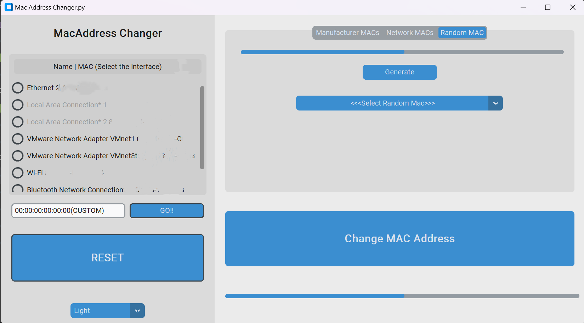
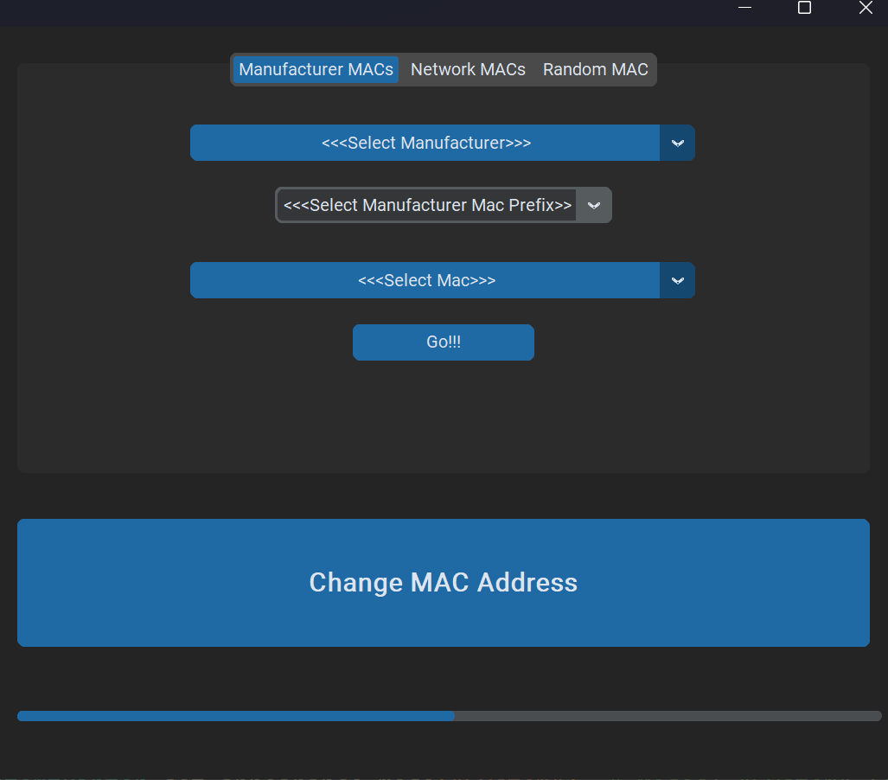
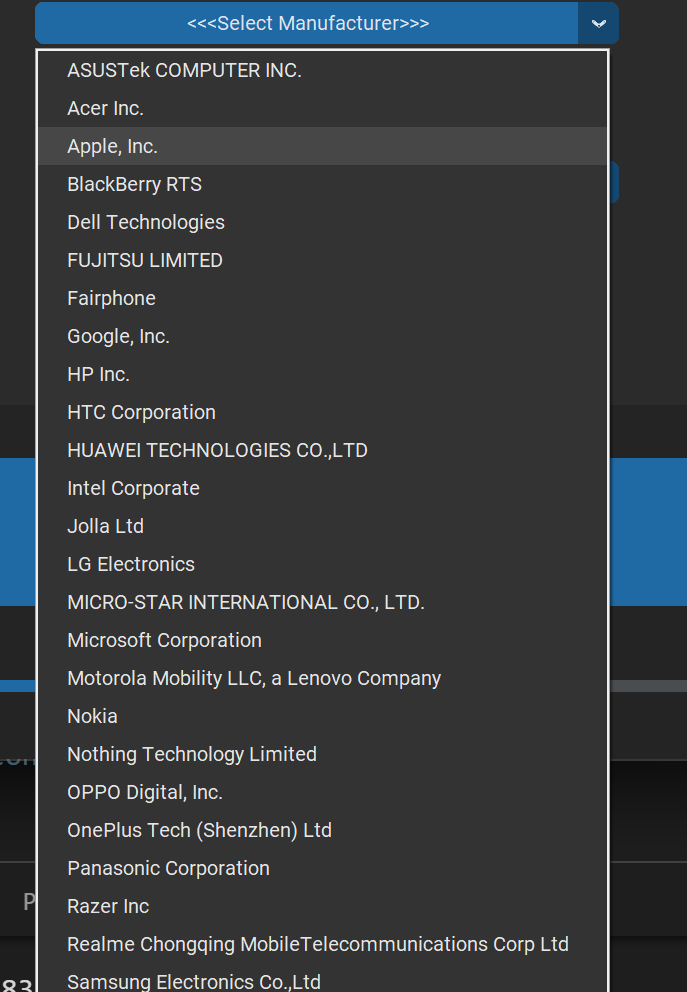
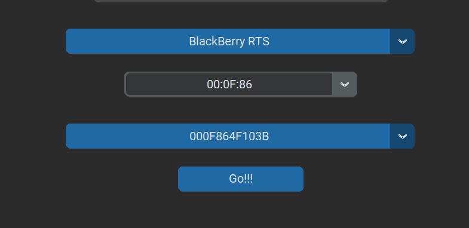

# Mac Address Changer

## Introduction
The Mac Address Changer application allows users to change the MAC address of their network adapters. It provides options to change the MAC address randomly, select from network devices, choose from manufacturer MAC prefixes, or input a custom MAC address. The app also displays connected adapters and their MAC addresses.

## Features
- Change MAC address using different methods:
  - Random MAC
  - Network MAC
  - Manufacturer MAC
  - Custom MAC
- Display connected adapters and their MAC addresses.
- Intuitive graphical user interface (GUI).
- Support for light, dark, and system appearance modes.

## Screenshots

## Requirements
- Python 3.x
- Tkinter
- Pandas
- Psutil
- Scapy
- Regex

## Usage
1. Run the application by executing the `MacAddressChanger.py` file.
2. Select the desired MAC address change method from the tabs.
3. Follow the instructions to specify the MAC address.
4. Click on the "Change MAC Address" button to apply the changes.

## License
This project is licensed under the MIT License - see the [LICENSE](LICENSE) file for details.

## Credits
- Developed by: Hassaan Hashmi
- Roll: i191777
- Section: CS(A)
- Degree: CYSEC
- Campus: Islamabad
- Course: Ethical Hacking
- Date: 11:32pm 3/10/24